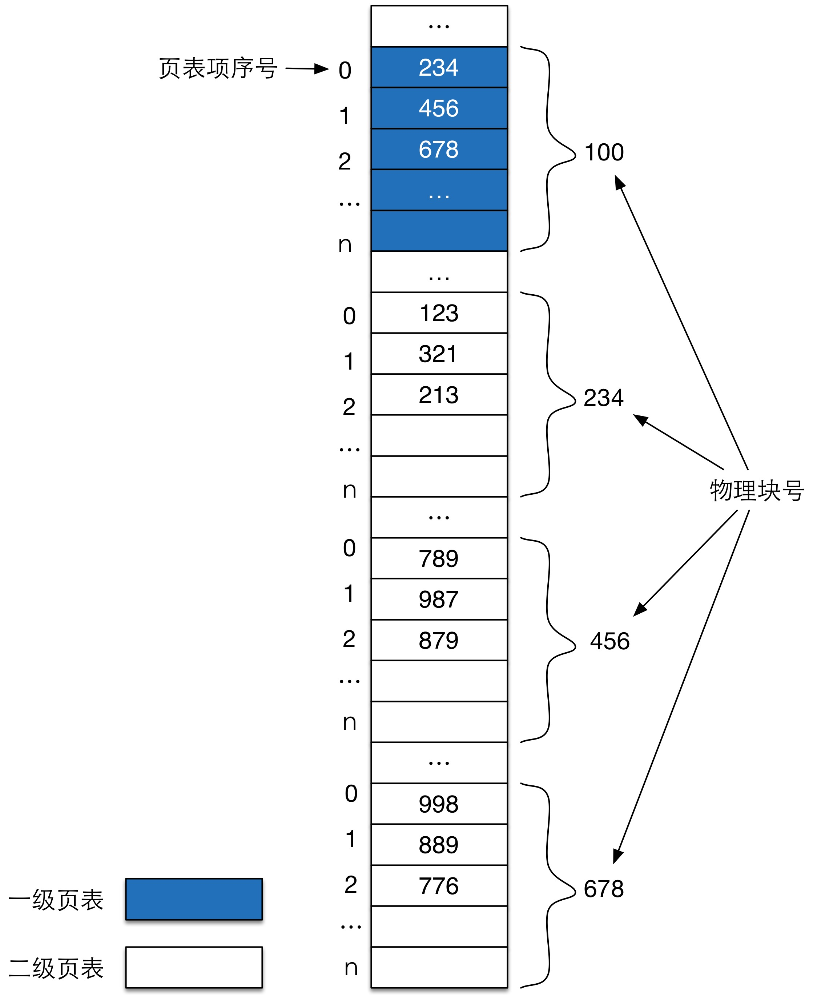

##作业4：
解：  
&nbsp;&nbsp;&nbsp;&nbsp;&nbsp;&nbsp;&nbsp;&nbsp;每个进程的总页面数为2^24B/1KB=2^14个；  
&nbsp;&nbsp;&nbsp;&nbsp;&nbsp;&nbsp;&nbsp;&nbsp;每个页面可存储页表项1KB/4B=256=2^8个；  
&nbsp;&nbsp;&nbsp;&nbsp;&nbsp;&nbsp;&nbsp;&nbsp;存储二级页表所需要的页面数为：
2^14/2^8=2^6个<2^8个，则一级页表可以在一个页面内存储完成。  
所以24位地址0-9位为页内偏移，10-17位为二级页号，18-23位为一级页号。    
526245对应的二进制表示（斜线表示上述逻辑切分）：10/00 0000 01/11 1010 0101  
按照上述划分方法得到：一级页号为2，二级页号1，页内地址0x03A5。

- 一级页表第2项查找到二级页表的物理块号：678
- 在678物理块的第1项找到物理块号889(0x0379），形成物理地址块号
- 与页内地址0x03A5拼接，形成完整的地址：1101 1110 01/11 1010 0101 即 0xDE7A5（十进制：911269）

